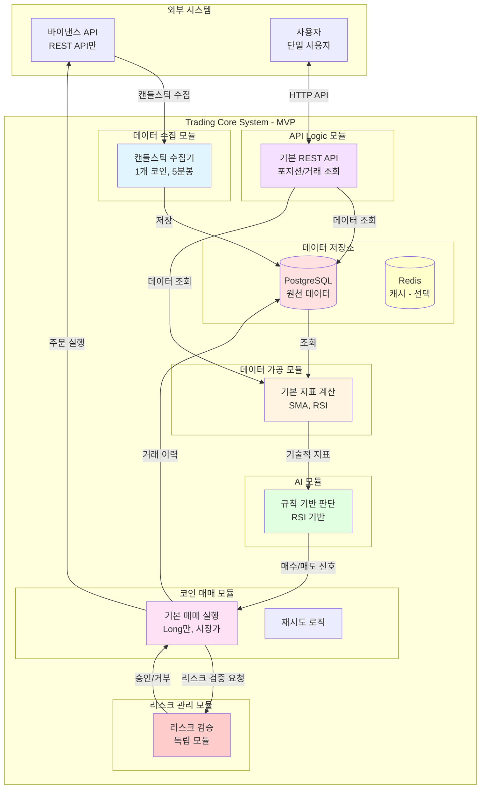

# MVP (Minimum Viable Product) 범위 정의

## MVP 목표

**핵심 가치 검증**: AI 기반 자동 매매 시스템이 실제로 작동하는가?

MVP는 다음을 검증합니다:
1. ✅ 데이터 수집 및 저장이 가능한가?
2. ✅ AI가 매매 신호를 생성할 수 있는가?
3. ✅ 실제 매매가 자동으로 실행되는가?
4. ✅ 사용자가 결과를 확인할 수 있는가?

---

## 모듈별 MVP 범위

### 1. 데이터 수집 모듈

#### ✅ MVP에 포함
- **바이낸스 API를 통한 캔들스틱 데이터 수집**
  - 1개 코인만 지원 (예: BTC/USDT)
  - 1분봉 또는 5분봉 데이터만 수집
  - REST API만 사용 (WebSocket은 제외)
- **기본 스케줄링**
  - 고정 주기(예: 5분마다) 데이터 수집
  - 간단한 재시도 로직 (최대 3회)
- **데이터 저장**
  - PostgreSQL에 OHLCV 데이터 저장
  - 기본적인 데이터 검증 (null 체크, 범위 체크)

#### ❌ MVP에서 제외
- 뉴스 기사 수집
- 소셜 미디어 감정 분석
- 온체인 데이터
- 거시경제 지표
- 호가창 데이터
- 실시간 가격 틱 데이터
- 고급 데이터 검증 및 품질 관리

**이유**: 핵심 가치는 "차트 데이터로 매매가 가능한가"를 검증하는 것이므로, 추가 데이터 소스는 MVP 이후에 추가

---

### 2. 데이터 가공 모듈

#### ✅ MVP에 포함
- **AI 판단용 기본 데이터 가공**
  - 단순 이동평균(SMA) 계산 (예: 5일, 20일)
  - RSI 계산 (14일)
  - 기본 데이터 정규화
- **대시보드용 기본 데이터 가공**
  - 최근 N개 캔들스틱 데이터 조회
  - 현재 가격 조회
  - 기본 통계 (최근 가격 변동률)

#### ❌ MVP에서 제외
- MACD, 볼린저 밴드 등 고급 기술적 지표
- 뉴스/감정 데이터 벡터화
- 복잡한 데이터 전처리
- 캐싱 최적화
- 고급 통계 계산 (샤프 비율, 최대 낙폭 등)

**이유**: MVP는 기본적인 기술적 지표만으로도 AI 판단이 가능한지 검증하는 것이 목표

---

### 3. 코인 매매 모듈

#### ✅ MVP에 포함
- **기본 포지션 관리**
  - Long 포지션 진입/청산만 지원 (Short는 제외)
  - 시장가 주문만 지원 (지정가는 제외)
  - 레버리지 없음 (1x만)
- **주문 실행**
  - 바이낸스 API를 통한 주문 실행
  - 주문 상태 추적 (진행중, 완료, 실패)
  - 거래 이력 저장
- **에러 처리 및 재시도**
  - Exponential Backoff 재시도 (최대 3회)
  - 서킷 브레이커 기본 구현 (Resilience4j)
  - 실패 로깅

#### ❌ MVP에서 제외
- Short 포지션
- 지정가 주문
- 레버리지 거래
- 부분 청산

**이유**: MVP는 "자동 매매가 실행되는가"를 검증하는 것이므로, 가장 단순한 형태의 매매만 지원

---

### 3-1. 리스크 관리 모듈 ⭐ 신규

#### ✅ MVP에 포함
- **독립 모듈로 분리**
  - 코인 매매 모듈과 분리된 독립 모듈
  - 리스크 검증 인터페이스 제공
- **기본 리스크 관리**
  - 고정 포지션 크기 계산 (예: 잔고의 10%)
  - 고정 손절가 계산 (예: -2%)
  - 고정 익절가 계산 (예: +5%)
  - 최대 손실 한도 검사 (예: 일일 -10%)
  - 최대 포지션 수 제한
- **감사 로그**
  - 모든 리스크 검증 결과 기록
  - 승인/거부 사유 기록

#### ❌ MVP에서 제외
- 동적 포지션 크기 계산
- 변동성 기반 손절/익절 계산
- 복잡한 리스크 관리 전략
- 포트폴리오 리스크 관리

**이유**: MVP는 리스크 관리 모듈의 독립성을 검증하는 것이 목표. 기본적인 리스크 검증만 지원

---

### 4. AI 모듈

#### ✅ MVP에 포함
- **기본 포지션 진입 판단**
  - 규칙 기반 로직으로 시작 (AI 모델은 제외)
  - 예: RSI < 30이면 매수, RSI > 70이면 매도
  - 매수/매도/보류 신호 생성
  - 간단한 신뢰도 점수 (0-100)
- **기본 모델 관리**
  - 단일 판단 로직만 사용
  - 설정 파일 기반 규칙 관리

#### ❌ MVP에서 제외
- 실제 AI 모델 (GPT, Claude, 자체 학습 모델)
- 복잡한 판단 로직
- 판단 근거 설명 생성
- AI 챗봇 기능
- 모델 버전 관리
- A/B 테스트

**이유**: MVP는 "자동 판단이 가능한가"를 검증하는 것이므로, 규칙 기반으로 시작하여 이후 AI 모델로 전환

**참고**: 규칙 기반으로 시작하되, 인터페이스를 AI 모델로 교체 가능하도록 설계

---

### 5. API Logic 모듈

#### ✅ MVP에 포함
- **기본 인증**
  - 단일 사용자만 지원 (다중 사용자는 제외)
  - 간단한 API 키 인증 (JWT는 제외 가능)
  - Spring Security 기본 설정
- **기본 대시보드 API**
  - 현재 포지션 현황 조회 (`GET /api/positions`)
  - 거래 이력 조회 (`GET /api/trades`)
  - 현재 가격 조회 (`GET /api/price`)
  - 기본 통계 조회 (`GET /api/stats`)
- **기본 설정 API**
  - 트레이딩 전략 설정 (`POST /api/strategy`)
  - 리스크 파라미터 설정 (`POST /api/risk`)
  - 설정 조회 (`GET /api/config`)
  - 설정 동적 새로고침 (`POST /actuator/refresh`)
- **에러 처리**
  - 전역 예외 핸들러
  - 표준화된 에러 응답 형식

#### ❌ MVP에서 제외
- 다중 사용자 지원
- 복잡한 권한 관리
- AI 챗봇 API
- WebSocket 실시간 업데이트
- 고급 통계 API
- 리포트 생성 API
- 알림 설정 API
- API 문서화 (Swagger)

**이유**: MVP는 "사용자가 결과를 확인할 수 있는가"를 검증하는 것이므로, 최소한의 조회 기능만 제공

---

### 6. 운영 인프라 (MVP 최소 요구사항)

#### ✅ MVP에 포함
- **로깅**
  - 구조화된 로깅 (JSON 형식)
  - 로그 레벨: ERROR, WARN, INFO
  - 모든 거래 및 리스크 검증 로깅
  - 파일 로깅 (로컬 파일)
- **기본 모니터링**
  - Spring Actuator 엔드포인트 (`/actuator/health`, `/actuator/metrics`)
  - 기본 메트릭 수집 (JVM, HTTP)
- **설정 관리**
  - 환경별 설정 분리 (local, sandbox, production)
  - 환경 변수 기반 설정 (Spring Cloud Config는 선택)
  - 동적 설정 새로고침 (`/actuator/refresh`)
- **보안 (최소)**
  - API 키 환경 변수 관리
  - 기본적인 데이터 마스킹 (로그에서 민감 정보 제거)
  - 감사 로그 (매매 실행, 설정 변경)

#### ❌ MVP에서 제외
- Prometheus + Grafana 통합
- 분산 추적 (OpenTelemetry)
- 중앙화된 로그 수집 (ELK, Loki)
- HashiCorp Vault 통합
- 고급 알림 시스템

**이유**: MVP는 핵심 기능 검증이 목표이므로, 최소한의 운영 도구만 포함

---

## MVP 아키텍처 다이어그램

---

## MVP Use Cases

### 1. 자동 매매 실행 (MVP 버전)

**전제 조건**:
- 바이낸스 API 연결
- 기본 전략 설정 완료 (RSI 기반)
- 충분한 잔고

**기본 흐름**:
1. 스케줄러가 5분마다 데이터 수집 트리거
2. 바이낸스 API에서 BTC/USDT 5분봉 데이터 수집 (재시도 로직 포함)
3. 데이터 저장 및 기본 지표 계산 (SMA, RSI)
4. 규칙 기반 판단: RSI < 30이면 매수, RSI > 70이면 매도
5. 매수/매도 신호 발생 시:
   - 리스크 관리 모듈에 검증 요청
   - 리스크 검증 통과 시 고정 포지션 크기로 주문 실행
   - 리스크 검증 실패 시 주문 거부 및 로깅
6. 주문 결과 저장 (성공/실패 모두)

**제한사항**:
- 1개 코인만 지원
- 규칙 기반 판단만 사용
- Long 포지션만 지원

---

### 2. 포지션 현황 조회 (MVP 버전)

**기본 흐름**:
1. 사용자가 `GET /api/positions` 호출
2. 현재 활성 포지션 조회
3. 포지션 정보 반환 (코인, 수량, 진입가, 현재가, 손익)

**제한사항**:
- 단순 조회만 지원
- 실시간 업데이트 없음 (폴링 필요)

---

### 3. 거래 이력 조회 (MVP 버전)

**기본 흐름**:
1. 사용자가 `GET /api/trades` 호출
2. 최근 거래 이력 조회
3. 거래 목록 반환 (날짜, 코인, 유형, 가격, 수량, 손익)

**제한사항**:
- 페이징 없음 (최근 100개만)
- 필터링 없음

---

## MVP 개발 우선순위

### Phase 1: 핵심 파이프라인 (2-3주)
1. ✅ 데이터 수집 모듈 (바이낸스 API 연동, 재시도 로직)
2. ✅ 데이터 저장 (PostgreSQL 스키마 설계)
3. ✅ 데이터 가공 모듈 (SMA, RSI 계산)
4. ✅ 규칙 기반 판단 로직
5. ✅ 리스크 관리 모듈 (독립 모듈로 구현)
6. ✅ 코인 매매 모듈 (기본 주문 실행, 서킷 브레이커)

### Phase 2: 사용자 인터페이스 및 운영 (1-2주)
7. ✅ API Logic 모듈 (기본 REST API, 에러 처리)
8. ✅ 로깅 시스템 (구조화된 JSON 로깅)
9. ✅ 기본 모니터링 (Spring Actuator)
10. ✅ 설정 관리 (환경별 분리, 동적 새로고침)
11. ✅ 보안 기본 설정 (API 키 관리, 감사 로그)

### Phase 3: 안정화 및 테스트 (1주)
12. ✅ 단위 테스트 및 통합 테스트
13. ✅ 에러 처리 강화
14. ✅ 문서화

---

## MVP 성공 기준

### 기능적 기준
- ✅ 5분마다 자동으로 데이터 수집
- ✅ RSI 기반으로 매수/매도 신호 생성
- ✅ 신호 발생 시 자동으로 주문 실행
- ✅ 사용자가 포지션 및 거래 이력 조회 가능

### 비기능적 기준
- ✅ 시스템이 24시간 이상 안정적으로 운영
- ✅ 주문 실행 실패 시 재시도 및 로깅
- ✅ 데이터 손실 없이 모든 거래 이력 저장
- ✅ 모든 리스크 검증 결과 감사 로그 기록
- ✅ 구조화된 로깅으로 디버깅 가능
- ✅ 기본 모니터링으로 시스템 상태 확인 가능

---

## MVP 이후 확장 계획

### Phase 2 (MVP + 1개월)
- 실제 AI 모델 통합 (GPT API 또는 자체 모델)
- 추가 기술적 지표 (MACD, 볼린저 밴드)
- WebSocket 실시간 업데이트
- 다중 코인 지원

### Phase 3 (MVP + 2개월)
- Short 포지션 지원
- 레버리지 거래
- 고급 리스크 관리
- AI 챗봇 기능
- 뉴스/소셜미디어 데이터 수집

---

## MVP 기술 스택 (최소)

### 필수
- Kotlin + Spring Boot
- Spring Modulith (모듈 분리)
- PostgreSQL
- 바이낸스 API 클라이언트
- HTTP 클라이언트 (OkHttp 또는 Spring WebClient)
- Resilience4j (재시도, 서킷 브레이커)
- Spring Actuator (모니터링)
- Logback (구조화된 로깅)

### 선택 (MVP에서 제외 가능)
- Redis (캐싱) - 성능 최적화 시 추가
- Spring Cloud Config (설정 중앙화) - 환경 변수로 대체 가능
- Prometheus + Grafana (고급 모니터링) - Phase 2에서 추가
- TimescaleDB (시계열 데이터) - Phase 2에서 추가

---

## MVP 리스크 관리

### 최소한의 안전장치
1. **일일 최대 손실 한도**: 설정 가능 (기본값: -10%)
2. **포지션 크기 제한**: 잔고의 최대 10%만 사용
3. **최대 포지션 수 제한**: 동시 포지션 수 제한
4. **수동 중지 기능**: API를 통한 트레이딩 중지
5. **상세 로깅**: 모든 주문 실행, 판단 로직, 리스크 검증 로깅
6. **감사 로그**: 모든 리스크 검증 결과 기록

### MVP에서 제외할 리스크 관리
- 복잡한 포트폴리오 관리
- 동적 리밸런싱
- 고급 헤징 전략
- 변동성 기반 동적 계산

---

## 결론

MVP는 **"자동 매매가 실제로 작동하는가"**를 검증하는 것이 목표입니다.

**핵심 기능**:
1. 데이터 수집 (1개 코인, 5분봉, 재시도 로직)
2. 기본 지표 계산 (SMA, RSI)
3. 규칙 기반 판단 (RSI 기반)
4. 리스크 관리 모듈 (독립 모듈, 기본 검증)
5. 자동 주문 실행 (Long만, 시장가, 서킷 브레이커)
6. 기본 조회 API (에러 처리 포함)
7. 로깅 및 모니터링 (구조화된 로깅, Actuator)
8. 설정 관리 (환경별 분리, 동적 새로고침)

**예상 개발 기간**: 4-6주 (1-2명 개발자 기준)

**예상 비용**: 최소 (바이낸스 API는 무료, 서버 비용만)

이 범위로 시작하여 핵심 가치를 빠르게 검증한 후, 사용자 피드백을 바탕으로 점진적으로 기능을 확장하는 것을 권장합니다.

