# Trading Core System Architecture

## 전체 시스템 아키텍처

이 문서는 Trading Core System의 전체 아키텍처를 다이어그램과 설명으로 제공합니다.

---

## 시스템 개요

Trading Core System은 6개의 주요 모듈로 구성된 마이크로서비스 아키텍처를 따릅니다:

1. **데이터 수집 모듈** (Data Collection Module)
2. **데이터 가공 모듈** (Data Processing Module)
3. **코인 매매 모듈** (Trading Module)
4. **AI 모듈** (AI Module)
5. **API Logic 모듈** (API Module)
6. **리스크 관리 모듈** (Risk Management Module) ⭐ 신규

---

## 전체 시스템 아키텍처 다이어그램 (추상화 버전)

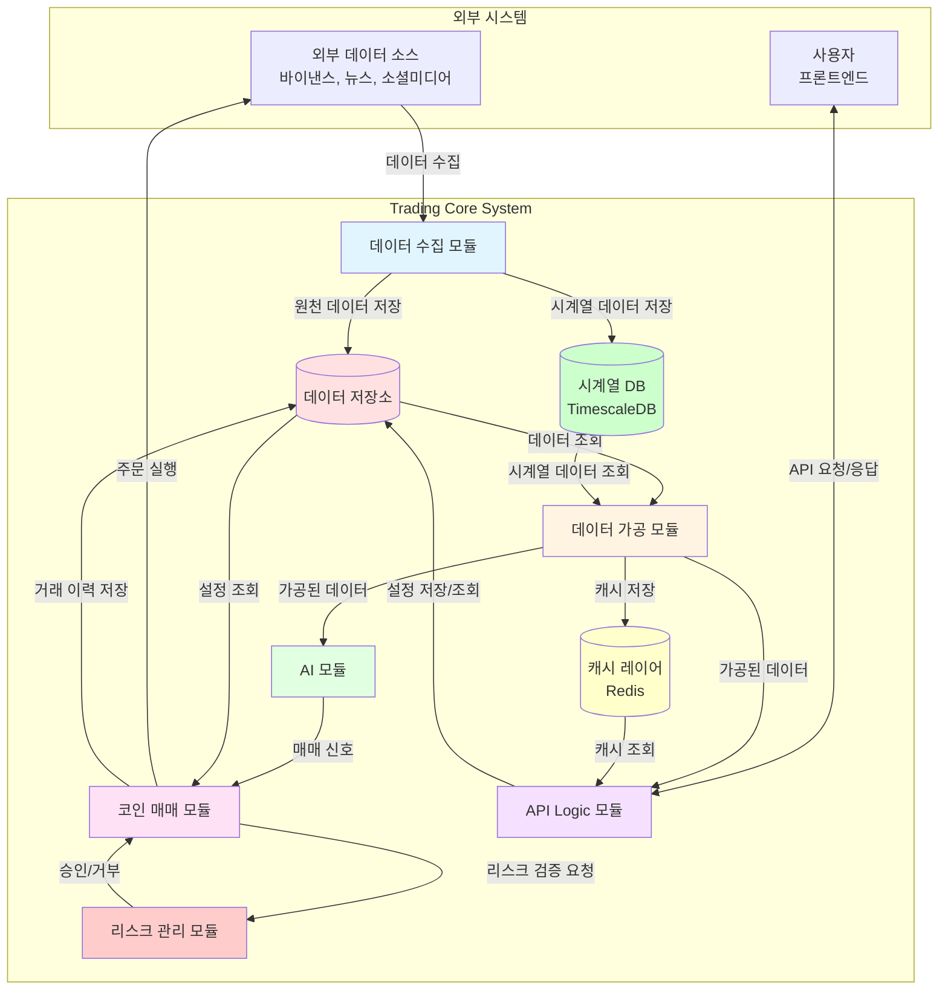

---

## 전체 시스템 아키텍처 다이어그램 (상세 버전)

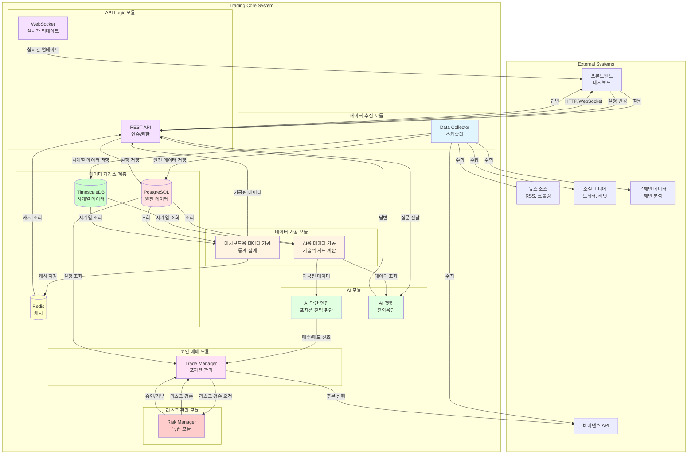

---

## 모듈별 상세 아키텍처

### 1. 데이터 수집 모듈

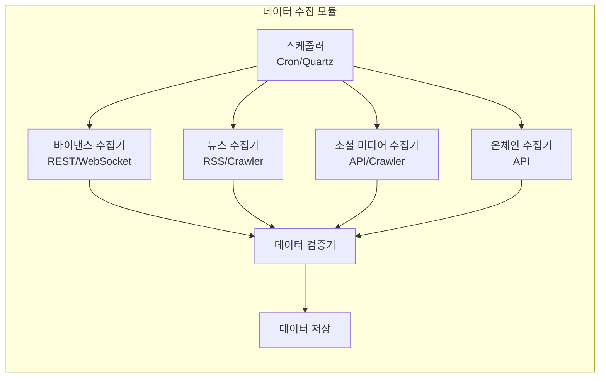

**주요 컴포넌트**:
- **스케줄러**: 주기적 데이터 수집 트리거
- **수집기들**: 각 외부 소스별 전용 수집기
- **검증기**: 데이터 품질 검증
- **저장소**: PostgreSQL에 원천 데이터 저장

---

### 2. 데이터 가공 모듈

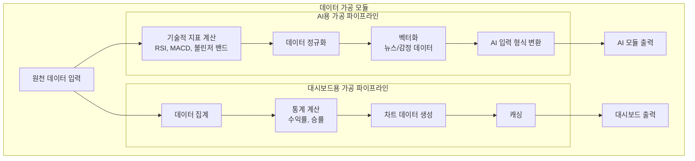

**주요 컴포넌트**:
- **AI용 파이프라인**: 기술적 지표 계산 및 AI 입력 형식 변환
- **대시보드용 파이프라인**: 사용자 친화적 데이터 집계 및 캐싱

---

### 3. 코인 매매 모듈

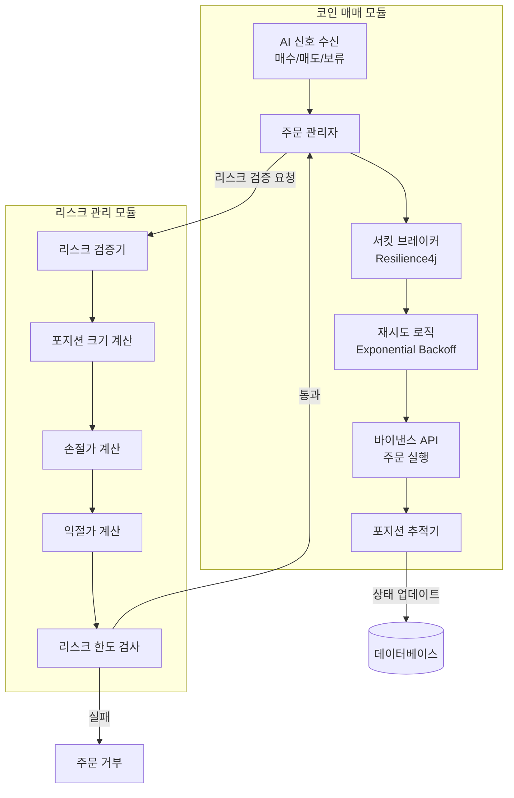

**주요 컴포넌트**:
- **주문 관리자**: 바이낸스 API를 통한 주문 실행
- **포지션 추적기**: 활성 포지션 모니터링 및 청산 관리
- **재시도 로직**: Exponential Backoff를 통한 실패 시 재시도
- **서킷 브레이커**: 외부 API 장애 시 자동 차단

**리스크 관리 모듈** (독립 모듈):
- **리스크 검증기**: 매매 전 리스크 검증
- **포지션 크기 계산**: 리스크 기반 포지션 크기 결정
- **손절/익절 계산**: 동적 손절/익절가 계산
- **리스크 한도 검사**: 일일/전체 손실 한도 검증

---

### 4. 리스크 관리 모듈

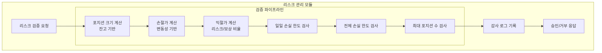

**주요 컴포넌트**:
- **포지션 크기 계산**: 잔고, 리스크 파라미터 기반 포지션 크기 결정
- **손절/익절 계산**: 변동성, 리스크/보상 비율 기반 동적 계산
- **손실 한도 검사**: 일일/전체 손실 한도 초과 여부 검증
- **포지션 수 제한**: 최대 동시 포지션 수 제한
- **감사 로그**: 모든 리스크 검증 결과 기록

**장점**:
- 리스크 정책의 독립적 관리 및 변경
- 여러 매매 전략에서 재사용 가능
- 리스크 관리 로직 테스트 용이

---

### 5. AI 모듈

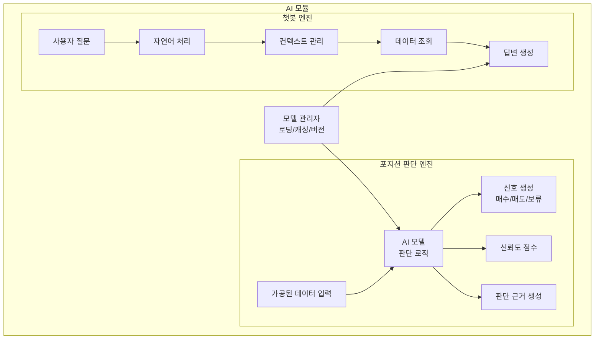

**주요 컴포넌트**:
- **포지션 판단 엔진**: AI 기반 매매 신호 생성
- **챗봇 엔진**: 사용자 질의응답 처리
- **모델 관리자**: AI 모델 라이프사이클 관리

---

### 6. API Logic 모듈

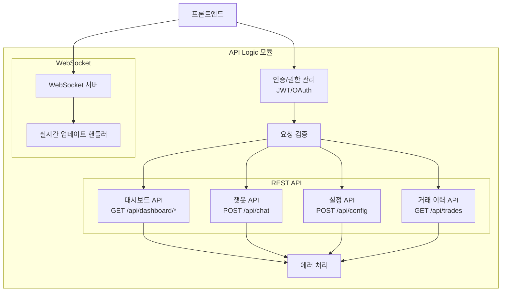

**주요 컴포넌트**:
- **인증/권한**: 사용자 인증 및 권한 관리
- **REST API**: HTTP 기반 API 엔드포인트
- **WebSocket**: 실시간 데이터 스트리밍
- **검증 및 에러 처리**: 요청 검증 및 에러 핸들링

---

## 데이터 흐름도

### 자동 매매 실행 흐름

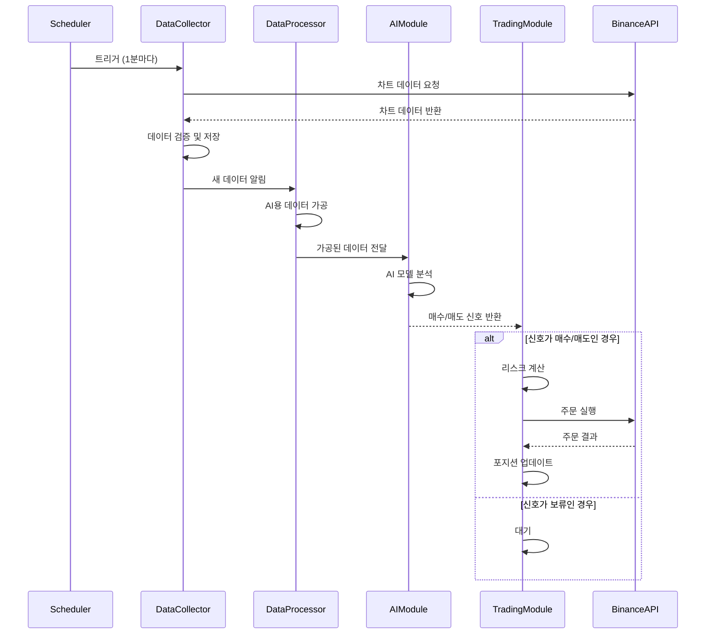

### 대시보드 조회 흐름

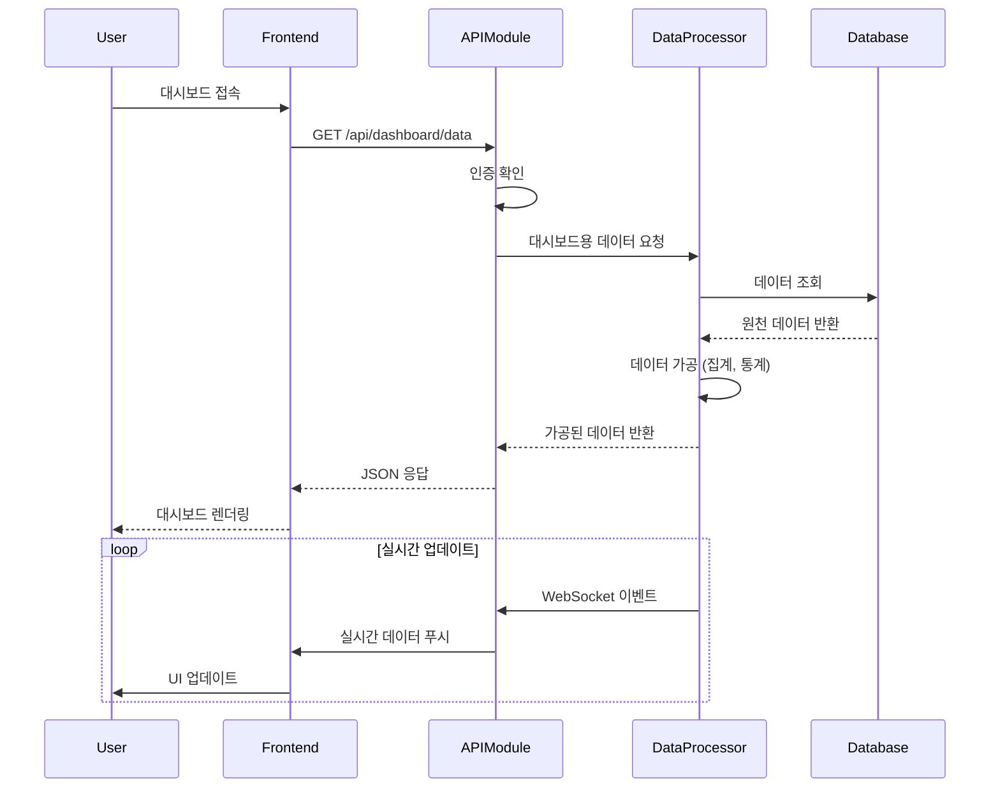

### AI 챗봇 질의응답 흐름

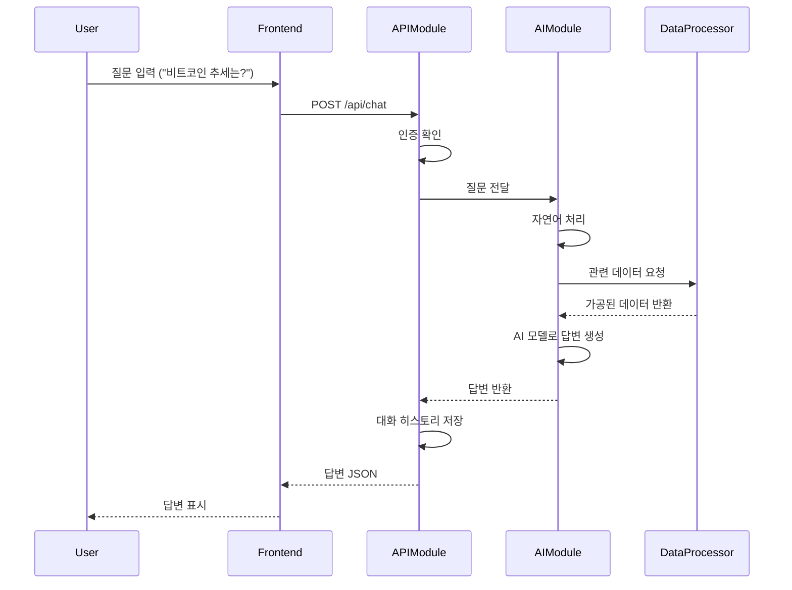

---

## 모듈 간 의존성

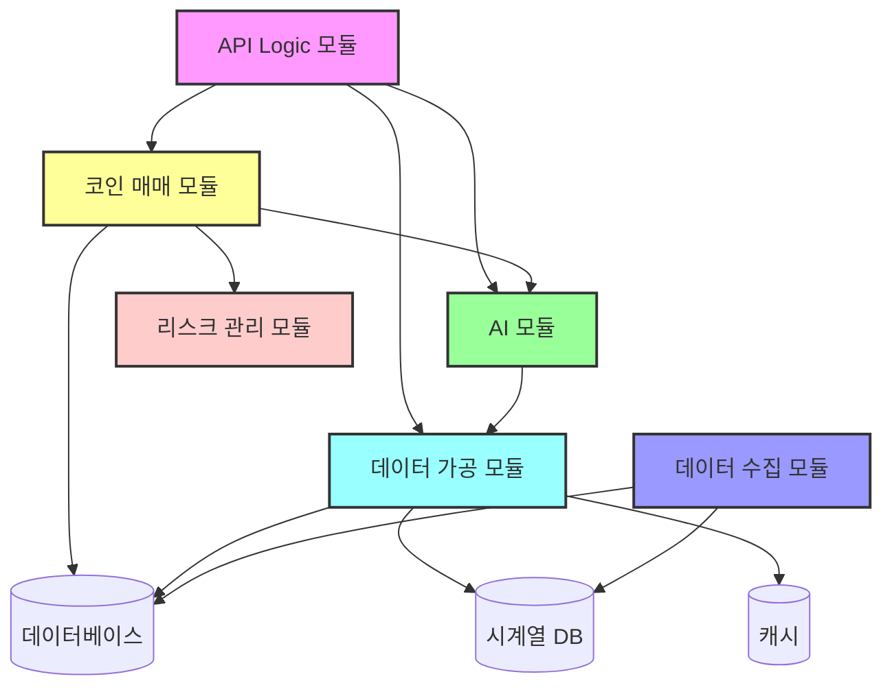

**의존성 규칙**:
- API Logic 모듈은 다른 모든 모듈에 의존 가능
- AI 모듈은 데이터 가공 모듈에만 의존
- 코인 매매 모듈은 AI 모듈, 리스크 관리 모듈, 데이터베이스에 의존
- 리스크 관리 모듈은 독립적 (다른 모듈에 의존하지 않음)
- 데이터 가공 모듈은 데이터베이스, 시계열 DB, 캐시에 의존
- 데이터 수집 모듈은 데이터베이스, 시계열 DB에만 의존

---

## 기술 스택 매핑

| 모듈 | 주요 기술 | 설명 |
|------|----------|------|
| 데이터 수집 모듈 | Kotlin, Spring Scheduler, HTTP Client, Resilience4j | 스케줄링 및 외부 API 호출, 재시도 로직 |
| 데이터 가공 모듈 | Kotlin, Spring Batch (선택), 계산 라이브러리 | 데이터 변환 및 집계 |
| 코인 매매 모듈 | Kotlin, HTTP Client, 상태 머신, Resilience4j | 주문 실행 및 포지션 관리, 서킷 브레이커 |
| 리스크 관리 모듈 | Kotlin, Spring Modulith | 리스크 검증 및 정책 관리 |
| AI 모듈 | Kotlin, AI 모델 라이브러리 (구현 시 결정) | AI 추론 및 자연어 처리 |
| API Logic 모듈 | Kotlin, Spring Web MVC, WebSocket, Spring Security | REST API 및 실시간 통신, 인증/권한 |
| 데이터 저장소 | PostgreSQL, TimescaleDB, Redis | 원천 데이터, 시계열 데이터, 캐시 |
| 설정 관리 | Spring Cloud Config (선택) | 중앙화된 설정 관리 |
| 모니터링 | Prometheus, Grafana, OpenTelemetry | 메트릭 수집 및 시각화, 분산 추적 |
| 로깅 | Logback, JSON 로깅 | 구조화된 로깅 |
| 보안 | Spring Security, Vault (선택) | 인증/권한, 비밀 관리 |

---

## 운영 인프라

### 모니터링 및 로깅

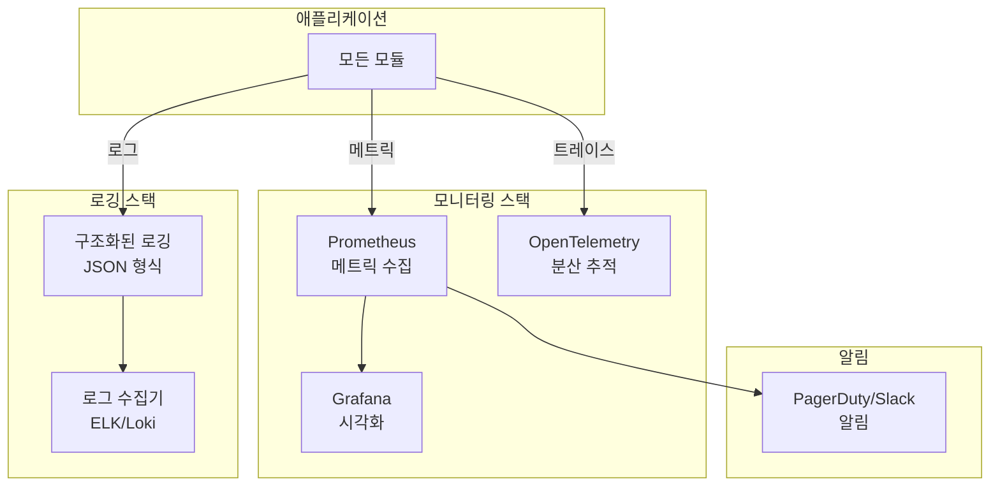

**주요 메트릭**:
- 시스템 메트릭: CPU, 메모리, 디스크
- 애플리케이션 메트릭: API 응답 시간, 에러율, 처리량
- 비즈니스 메트릭: 거래 수, 수익률, 포지션 수

**로깅 전략**:
- 구조화된 JSON 로깅
- 로그 레벨: ERROR, WARN, INFO, DEBUG
- 민감 정보 마스킹
- 모든 거래 및 리스크 검증 로깅

---

### 설정 관리

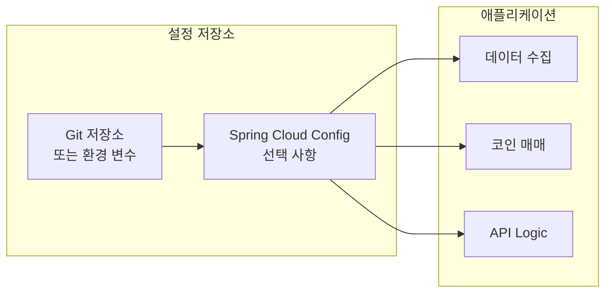

**설정 관리 전략**:
- 환경별 설정 분리: local, sandbox, production
- 동적 설정 변경: `/actuator/refresh` 엔드포인트
- 민감 정보 암호화: Spring Cloud Config 암호화 기능
- 설정 버전 관리: Git을 통한 설정 변경 이력

---

### 에러 처리 및 재시도 전략

**재시도 전략**:
- Exponential Backoff: 1초, 2초, 4초, 8초...
- 최대 재시도 횟수: 3회
- 재시도 가능한 에러: 네트워크 타임아웃, 5xx 에러
- 재시도 불가능한 에러: 4xx 에러, 인증 실패

**서킷 브레이커**:
- Resilience4j 사용
- 실패율 임계값: 50%
- 서킷 열림 시간: 60초
- 반개방 상태에서 점진적 복구

**데드 레터 큐 (DLQ)**:
- 실패한 작업 저장
- 수동 재처리 가능
- 실패 원인 분석

---

### 보안 강화

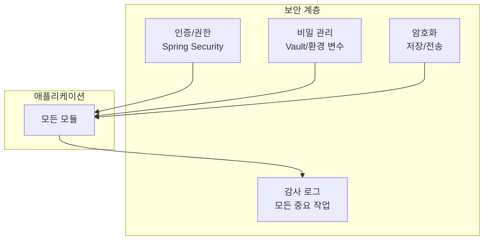

**보안 전략**:
- **API 키 관리**: HashiCorp Vault 또는 환경 변수
- **데이터 암호화**: 
  - 저장 시 암호화 (encryption at rest)
  - 전송 시 암호화 (TLS)
- **감사 로그**: 모든 중요한 작업 기록
  - 매매 실행
  - 설정 변경
  - 리스크 검증 결과
  - 사용자 인증/권한 변경

---

### 데이터 저장소 계층화

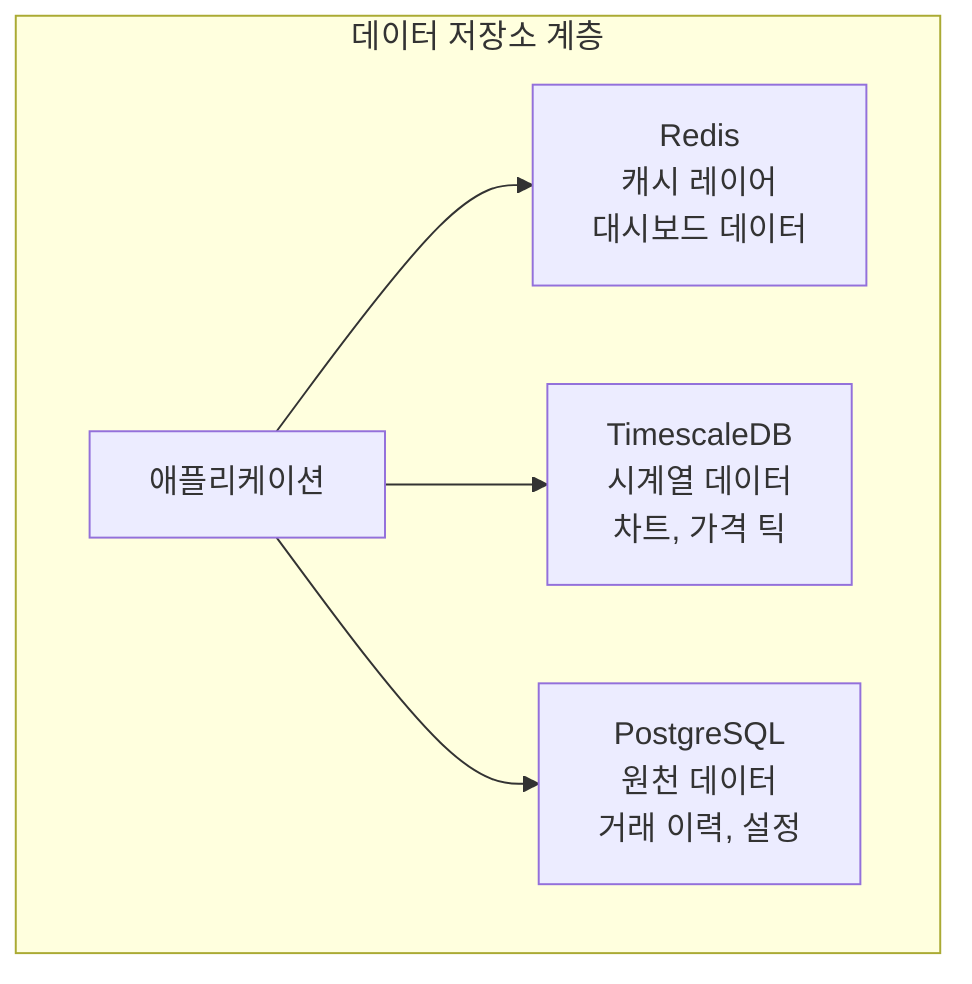

**데이터 저장 전략**:
- **원천 데이터 (PostgreSQL)**: 거래 이력, 설정, 사용자 정보
- **시계열 데이터 (TimescaleDB)**: 차트 데이터, 가격 틱, 기술적 지표
- **캐시 (Redis)**: 대시보드 데이터, 실시간 지표, 세션 데이터

**장점**:
- 각 저장소의 특성에 맞는 최적화
- 실시간 조회 성능 향상
- 데이터베이스 부하 분산

---

## 확장성 고려사항

### 수평 확장
- 각 모듈은 독립적으로 확장 가능
- 로드 밸런서를 통한 다중 인스턴스 운영
- 상태 없는(stateless) 설계 권장

### 데이터베이스 확장
- 읽기 전용 복제본 활용
- 샤딩 전략 (코인별, 시간별)
- 캐싱 레이어 활용 (Redis)

### 메시징 큐 도입 (향후)
- 모듈 간 비동기 통신
- 이벤트 기반 아키텍처로 전환 가능
- RabbitMQ, Kafka 등 고려

---

## 테스트 전략

### 단위 테스트
- 각 모듈의 핵심 로직 테스트
- Mock을 활용한 의존성 격리
- 코드 커버리지 목표: 80% 이상

### 통합 테스트
- 모듈 간 상호작용 테스트
- Testcontainers를 활용한 데이터베이스 테스트
- 외부 API Mock 서버 활용

### E2E 테스트
- 전체 시나리오 테스트
- 실제 바이낸스 샌드박스 환경 활용
- 페이퍼 트레이딩 모드

### 백테스팅
- 과거 데이터로 전략 검증
- 성능 지표 계산 (수익률, 샤프 비율 등)

