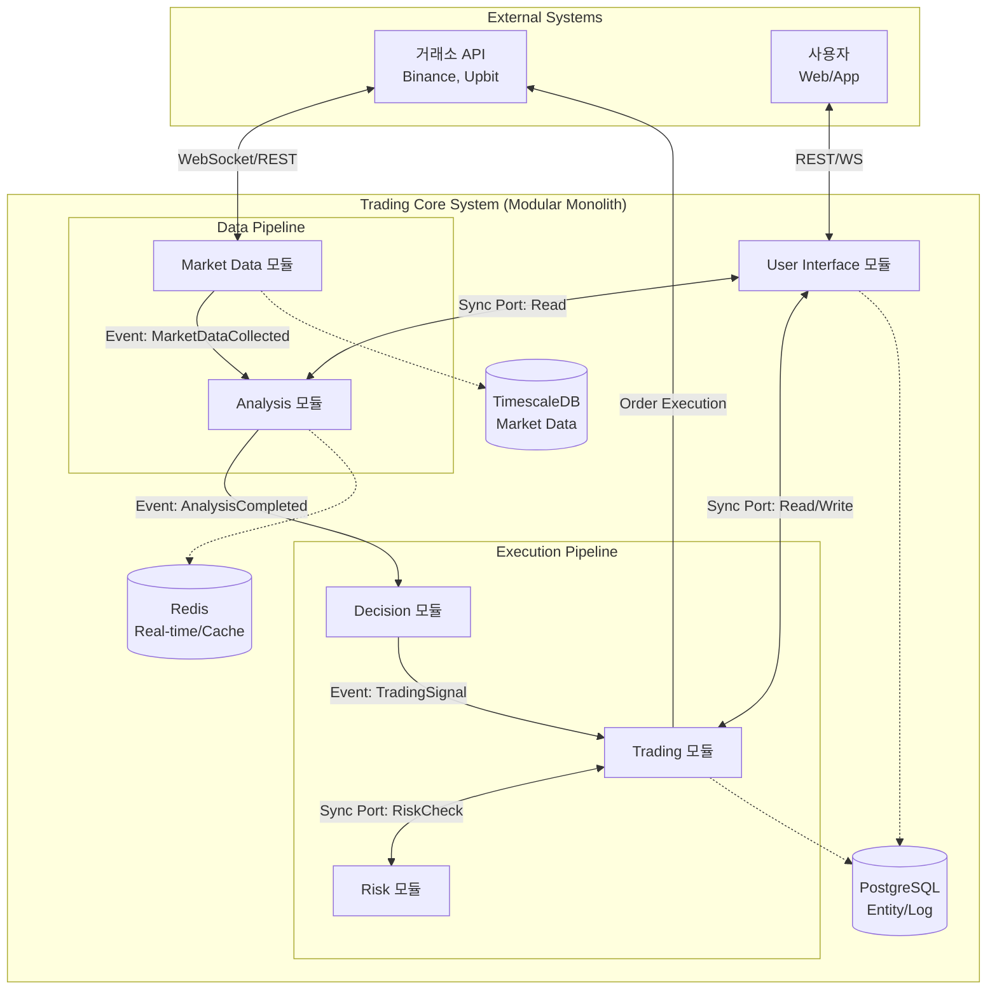
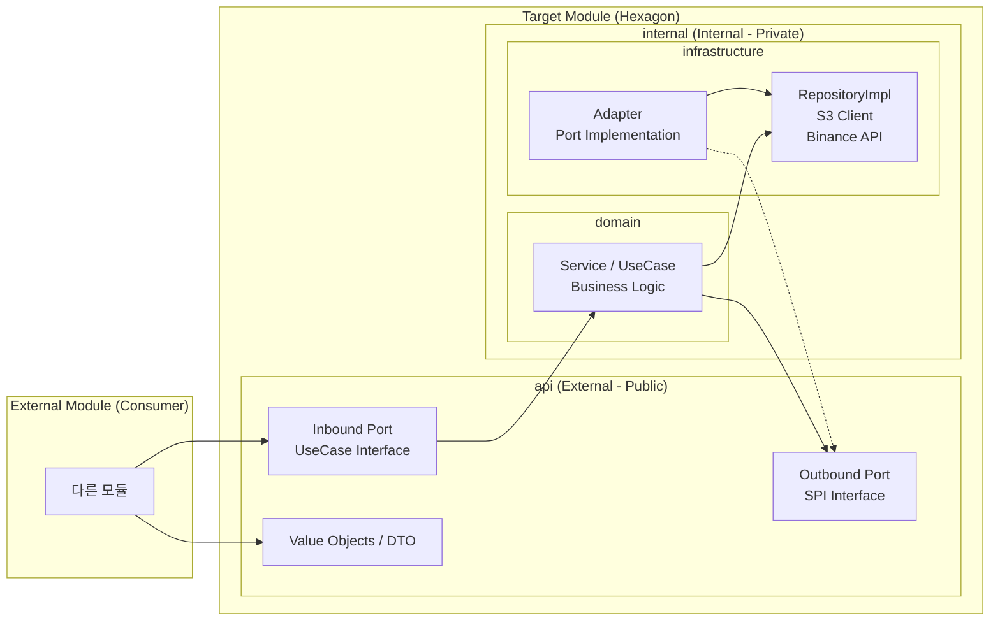

# 🚀 Trading Core System Architecture

이 문서는 **Trading Core System**의 전체 아키텍처와 설계 원칙, 모듈 간 상호작용을 다룹니다.  
본 시스템은 **Modular Monolith** 구조를 채택하여 마이크로서비스의 유연성과 모놀리스의 개발 편의성을 동시에 확보합니다.

---

## 🏗️ 설계 철학 (Design Principles)

### 1. Modular Monolith (Spring Modulith)

- 물리적으로는 하나의 배포 단위를 유지하되, 논리적으로는 완벽히 분리된 **6개의 Bounded Context**를 가집니다.
- 각 모듈은 자신만의 데이터베이스 스키마와 비즈니스 로직을 격리하여 관리합니다.

### 2. Hexagonal Architecture (Ports and Adapters)

- 외부 기술(DB, 외부 API)과 비즈니스 로직을 철저히 격리합니다.
- 각 모듈은 `api/` (외부 노출 영역)와 `internal/` (캡슐화된 구현 영역) 패키지로 구성됩니다.

### 3. Event-Driven & Sync Hybrid

- 데이터 가공 흐름(수집 → 지표 → 신호)은 **이벤트 기반 비동기 처리**를 지향합니다.
- 즉각적인 승인이 필요한 주문/리스크 검증 흐름은 **동기 Port 호출**을 사용합니다.

---

## 📦 시스템 모듈 개요

도메인 책임에 따라 시스템은 다음과 같이 **6개의 모듈**로 분리됩니다.

1. **Market Data (`marketdata`)**
    - 외부 거래소 데이터 수집 및 정규화
2. **Analysis (`analysis`)**
    - 기술적 지표 계산 및 데이터 가공
3. **Decision (`decision`)**
    - 전략 실행 및 매매 신호(Signal) 생성
4. **Trading (`trading`)**
    - 주문 집행 및 포지션 관리
5. **Risk Management (`risk`)**
    - 실시간 리스크 검증 및 방어선 역할
6. **User Interface (`ui`)**
    - REST API 및 실시간 알림 제공

---

## 📊 전체 시스템 아키텍처 다이어그램

## 📂 모듈 내부 구조 및 패키지 규칙

모든 모듈은 Hexagonal Architecture를 기반으로 아래 구조를 따릅니다.

## 📦 패키지 가시성 가이드

- api/
    - 타 모듈에서 참조 가능한 유일한 진입점
    - public 선언
- internal/
    - 모듈 내부 전용
    - Kotlin internal 키워드로 외부 import 차단
- domain/
    - 기술에 독립적인 순수 비즈니스 로직
    - UseCase 구현체 위치
- infrastructure/
    - DB(persistence)
    - 외부 API 연동
    - 타 모듈 Adapter 구현

## 🛠️ 기술 스택 (Tech Stack)

| 구분 | 기술 | 비고 |
|---|---|---|
| 언어 / 프레임워크 | Kotlin, Spring Boot 4 | 최신 문법 및 생산성 극대화 |
| 모듈화 지원 | Spring Modulith | 모듈 간 결합도 검증 및 이벤트 관리 |
| 데이터베이스 | PostgreSQL / TimescaleDB | 엔티티 / 대용량 시계열 데이터 분리 |
| 캐시 / 실시간 | Redis | 지표 결과 캐싱 및 상태 관리 |
| 회복성 | Resilience4j | 서킷 브레이커, 재시도(Retry) |
