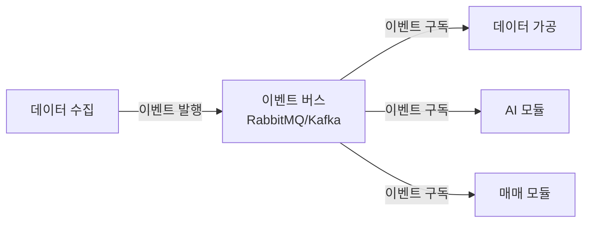

# 설계 적절성 검토 (Design Review)

## 개요

이 문서는 Trading Core System의 아키텍처 설계에 대한 검토 및 개선 제안을 제공합니다.

---

## 설계 강점

### 1. 모듈 분리 원칙 준수
✅ **좋은 점**: 각 모듈이 명확한 책임을 가지고 있어 단일 책임 원칙(SRP)을 잘 따르고 있습니다.
- 데이터 수집 모듈: 수집만 담당
- 데이터 가공 모듈: 가공만 담당
- 코인 매매 모듈: 매매 실행만 담당
- AI 모듈: AI 판단만 담당
- API Logic 모듈: 인터페이스 제공만 담당

### 2. 의존성 방향 명확
✅ **좋은 점**: 모듈 간 의존성이 단방향으로 설계되어 있어 순환 의존성이 없습니다.
```
데이터 수집 → 데이터베이스
데이터 가공 → 데이터베이스
코인 매매 → AI 모듈
API Logic → 다른 모든 모듈
```

### 3. 확장성 고려
✅ **좋은 점**: 각 모듈이 독립적으로 확장 가능하도록 설계되어 있습니다.

---

## 개선이 필요한 부분

### 1. 이벤트 기반 아키텍처 고려 ⚠️

**현재 설계의 문제점**:
- 모듈 간 동기적 호출로 인한 결합도 증가
- 한 모듈의 장애가 다른 모듈에 직접 전파
- 확장성 제한 (특히 데이터 수집 → 가공 → AI → 매매 파이프라인)

**개선 제안**:


**장점**:
- 모듈 간 느슨한 결합
- 비동기 처리로 성능 향상
- 장애 격리 (한 모듈 장애가 다른 모듈에 직접 영향 없음)
- 이벤트 재생(replay) 가능

**구현 우선순위**: 중기 (시스템 안정화 후)

---

### 2. 데이터 저장소 계층화 필요 ⚠️

**현재 설계의 문제점**:
- 모든 데이터가 PostgreSQL에만 저장되어 있음
- 실시간 데이터 조회 시 성능 이슈 가능
- 시계열 데이터에 최적화되지 않음

**개선 제안**:
```
PostgreSQL 인스턴스 (TimescaleDB Extension 포함)
├── 일반 테이블 (거래 이력, 설정, 사용자 정보)
└── TimescaleDB 하이퍼테이블 (차트 데이터, 가격 틱)
  ↓
캐시 레이어 (Redis)
  ↓
애플리케이션
```

**중요**: TimescaleDB는 별도의 데이터베이스가 아니라 **PostgreSQL의 Extension**입니다.
- 같은 PostgreSQL 인스턴스에서 사용 가능
- `CREATE EXTENSION timescaledb;`로 활성화
- 별도의 DB 인스턴스 불필요 (MVP 단계)

**데이터 저장 전략**:
- **일반 테이블 (PostgreSQL)**: 거래 이력, 설정, 사용자 정보
- **하이퍼테이블 (TimescaleDB Extension)**: 차트 데이터, 가격 틱
- **캐시 (Redis)**: 대시보드 데이터, 실시간 지표

**구현 우선순위**: 
- MVP: 단일 PostgreSQL 사용 (TimescaleDB Extension 없음)
- Phase 2: TimescaleDB Extension 추가하여 하이퍼테이블로 전환

**자세한 내용**: `docs/architecture/DATABASE_STRATEGY.md` 참고

---

### 3. 리스크 관리 모듈 분리 고려 ⚠️

**현재 설계의 문제점**:
- 리스크 관리가 코인 매매 모듈 내부에 포함되어 있음
- 리스크 정책 변경 시 매매 모듈 수정 필요
- 리스크 관리 로직 재사용 어려움

**개선 제안**:
```
코인 매매 모듈
  ↓ (리스크 검증 요청)
리스크 관리 모듈 (독립 모듈)
  ↓ (승인/거부)
코인 매매 모듈
```

**장점**:
- 리스크 정책의 독립적 관리
- 여러 매매 전략에서 리스크 모듈 재사용
- 리스크 관리 로직 테스트 용이

**구현 우선순위**: 단기 (핵심 기능)

---

### 4. 모니터링 및 로깅 시스템 부재 ⚠️

**현재 설계의 문제점**:
- 모니터링 및 로깅 전략이 명시되지 않음
- 장애 발생 시 디버깅 어려움
- 성능 모니터링 불가

**개선 제안**:
- **로깅**: 구조화된 로깅 (JSON 형식)
- **메트릭 수집**: Prometheus + Grafana
- **분산 추적**: OpenTelemetry 또는 Zipkin
- **알림**: PagerDuty, Slack 등

**구현 우선순위**: 단기 (운영 필수)

---

### 5. 설정 관리 중앙화 필요 ⚠️

**현재 설계의 문제점**:
- 설정이 데이터베이스에만 저장되어 있음
- 환경별 설정 관리 어려움
- 설정 변경 시 재시작 필요할 수 있음

**개선 제안**:
- **설정 저장소**: Spring Cloud Config 또는 환경 변수
- **동적 설정**: 설정 변경 시 재시작 없이 적용
- **환경별 분리**: local, sandbox, production

**구현 우선순위**: 단기 (개발 편의성)

---

### 6. 에러 처리 및 재시도 전략 부재 ⚠️

**현재 설계의 문제점**:
- 외부 API 호출 실패 시 재시도 전략이 명시되지 않음
- 부분 실패 처리 전략 없음
- 에러 복구 메커니즘 부재

**개선 제안**:
- **재시도 전략**: Exponential Backoff
- **서킷 브레이커**: Resilience4j 또는 Hystrix
- **데드 레터 큐**: 실패한 작업 저장 및 재처리

**구현 우선순위**: 단기 (안정성 필수)

---

### 7. 데이터 수집 모듈의 확장성 ⚠️

**현재 설계의 문제점**:
- 여러 데이터 소스를 하나의 모듈에서 처리
- 새로운 데이터 소스 추가 시 모듈 수정 필요

**개선 제안**:
```
데이터 수집 모듈
  ├── 바이낸스 수집기 (독립 서브모듈)
  ├── 뉴스 수집기 (독립 서브모듈)
  ├── 소셜 미디어 수집기 (독립 서브모듈)
  └── 온체인 수집기 (독립 서브모듈)
```

**또는 플러그인 아키텍처**:
- 각 수집기를 플러그인으로 구현
- 동적 로딩 및 확장 가능

**구현 우선순위**: 중기 (확장성 개선)

---

### 8. AI 모듈의 모델 관리 전략 부재 ⚠️

**현재 설계의 문제점**:
- AI 모델 버전 관리 전략이 불명확
- A/B 테스트 어려움
- 모델 롤백 전략 없음

**개선 제안**:
- **모델 버전 관리**: MLflow 또는 자체 레지스트리
- **A/B 테스트**: 여러 모델 동시 운영 및 비교
- **모델 롤백**: 이전 버전으로 빠른 복구

**구현 우선순위**: 중기 (AI 기능 고도화)

---

### 9. 보안 강화 필요 ⚠️

**현재 설계의 문제점**:
- API 키 관리 전략이 불명확
- 데이터 암호화 전략 부재
- 감사 로그(audit log) 부재

**개선 제안**:
- **비밀 관리**: HashiCorp Vault 또는 AWS Secrets Manager
- **데이터 암호화**: 저장 시 암호화(encryption at rest), 전송 시 암호화(TLS)
- **감사 로그**: 모든 중요한 작업 기록 (매매, 설정 변경 등)

**구현 우선순위**: 단기 (보안 필수)

---

### 10. 테스트 전략 부재 ⚠️

**현재 설계의 문제점**:
- 테스트 전략이 명시되지 않음
- 모듈별 테스트 방법 불명확

**개선 제안**:
- **단위 테스트**: 각 모듈의 핵심 로직
- **통합 테스트**: 모듈 간 상호작용
- **E2E 테스트**: 전체 시나리오 테스트
- **백테스팅**: 과거 데이터로 전략 검증

**구현 우선순위**: 단기 (품질 보장)

---

## 우선순위별 개선 로드맵

### Phase 1: 필수 기능 (1-2개월)
1. ✅ 리스크 관리 모듈 분리
2. ✅ 모니터링 및 로깅 시스템 구축
3. ✅ 설정 관리 중앙화
4. ✅ 에러 처리 및 재시도 전략
5. ✅ 보안 강화
6. ✅ 테스트 전략 수립

### Phase 2: 성능 최적화 (2-3개월)
1. ✅ 데이터 저장소 계층화 (TimescaleDB, Redis)
2. ✅ 캐싱 전략 수립
3. ✅ 데이터베이스 최적화

### Phase 3: 확장성 개선 (3-6개월)
1. ✅ 이벤트 기반 아키텍처 도입
2. ✅ 데이터 수집 모듈 플러그인화
3. ✅ AI 모델 관리 시스템 구축

---

## 설계 검토 결론

### 전체 평가: ⭐⭐⭐⭐ (4/5)

**강점**:
- 모듈 분리가 명확하고 책임이 잘 정의됨
- 의존성 방향이 명확하여 순환 의존성 없음
- 확장 가능한 구조

**개선 필요**:
- 운영 관점의 모니터링, 로깅, 보안 강화 필요
- 성능 최적화를 위한 데이터 저장소 계층화 필요
- 장기적으로 이벤트 기반 아키텍처 고려

**권장 사항**:
1. **단기**: 리스크 관리 모듈 분리, 모니터링/로깅, 보안 강화
2. **중기**: 데이터 저장소 계층화, 이벤트 기반 아키텍처 도입
3. **장기**: AI 모델 관리 시스템, 플러그인 아키텍처

현재 설계는 **MVP(Minimum Viable Product) 단계에서는 충분히 적절**하며, 위의 개선 사항들을 단계적으로 적용하면 **프로덕션 환경에서도 안정적으로 운영 가능**합니다.

